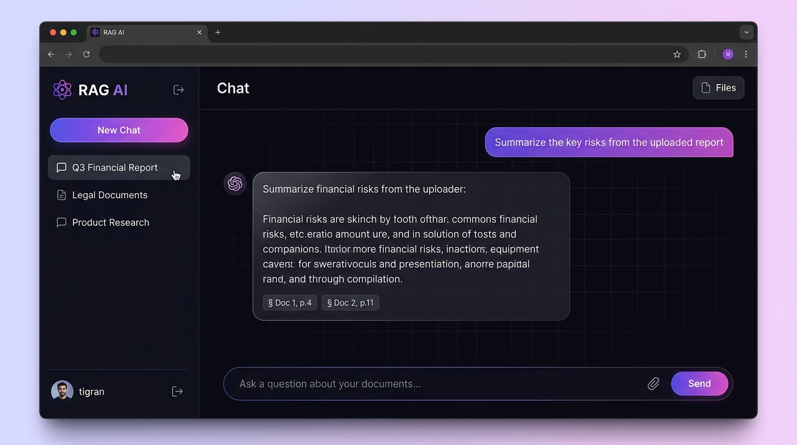
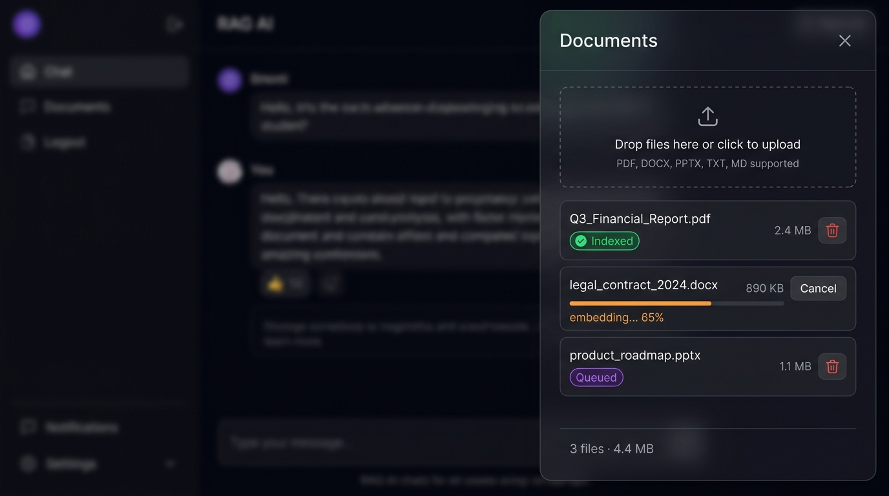
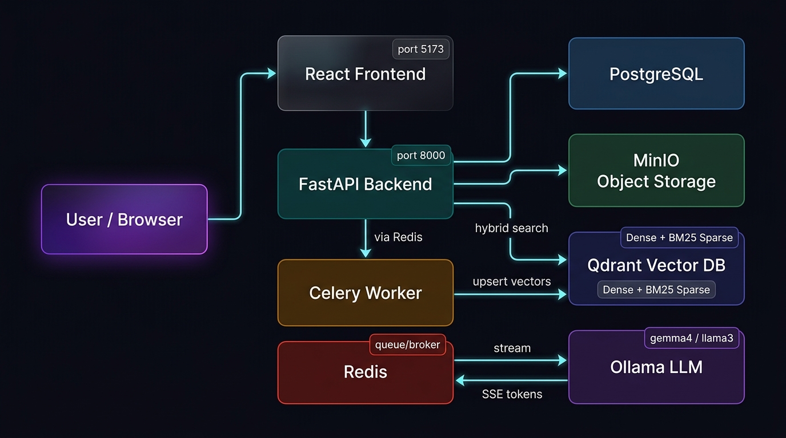
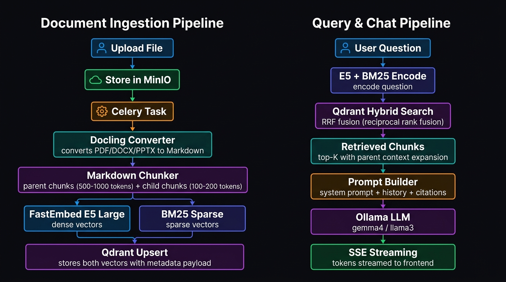

<div align="center">

# 🧠 RAG AI

**Production-ready Retrieval-Augmented Generation platform with real-time streaming, hybrid vector search, and multilingual document understanding.**

[](https://fastapi.tiangolo.com/)
[](https://react.dev/)
[](https://qdrant.tech/)
[](https://ollama.com/)
[](https://docs.celeryq.dev/)
[](https://docs.docker.com/compose/)
[](LICENSE)

</div>

---

## ✨ Overview

RAG AI is a fully self-hosted, privacy-first document Q&A platform. Upload your files, ask questions in any language, and get accurate answers streamed in real time — all grounded in the actual content of your documents, with clickable source citations.

Everything runs in Docker with no external API keys needed. Your documents and conversations never leave your infrastructure.

---

## 📸 Screenshots

### Chat Interface


### Document Manager


---

## 🏗️ Architecture



The system is composed of fully containerized microservices:

| Service | Technology | Role |
|---|---|---|
| **Frontend** | React 19 + TypeScript + Vite | Chat UI, file management |
| **API** | FastAPI + SQLModel | REST & SSE endpoints |
| **Worker** | Celery + Redis | Background ingestion tasks |
| **Vector DB** | Qdrant | Hybrid dense + sparse search |
| **Object Storage** | MinIO | Raw file storage |
| **Database** | PostgreSQL | Users, conversations, jobs |
| **LLM** | Ollama (local) | Token generation & streaming |
| **Cache/Queue** | Redis | Task broker & result backend |

---

## 🔬 RAG Pipeline



### Document Ingestion (Celery Background Task)

```
Upload → MinIO storage → Celery task dispatched → Docling converter
→ Markdown chunker (parent 500-1000 tok, child 100-200 tok, 15% overlap)
→ FastEmbed E5-Large (dense) + BM25 (sparse) encoding
→ Qdrant upsert (hybrid collection per conversation)
```

### Query & Retrieval

```
User message → E5 + BM25 dual encode → Qdrant Hybrid Search (RRF fusion)
→ Parent-context expansion → Prompt builder (system + history + citations)
→ Ollama LLM → SSE token stream → Frontend
```

**Key techniques:**
- **Hybrid retrieval**: Dense semantic (E5-Large) + BM25 sparse fused with Reciprocal Rank Fusion (RRF)
- **Parent-child chunking**: Small child chunks are retrieved, but the full parent context is sent to the LLM
- **Contextual embeddings**: Each child chunk is prefixed with a document summary before embedding for better semantic alignment
- **Anti-hallucination prompting**: System prompt enforces strict citation rules — the model may only answer from retrieved context

---

## 🗂️ Project Structure

```
rag-ai/
├── app/                          # FastAPI backend
│   ├── core/
│   │   ├── database.py           # SQLModel engine & session
│   │   ├── minio.py              # MinIO client
│   │   └── settings.py           # Pydantic settings (env-driven)
│   ├── models/                   # SQLModel ORM models
│   │   ├── user.py               # User, auth
│   │   ├── conversation.py       # Conversation
│   │   ├── file.py               # File metadata
│   │   ├── ingestion.py          # IngestionJob (status, progress)
│   │   └── message.py            # Chat message history
│   ├── routers/                  # FastAPI route handlers
│   │   ├── auth.py               # Register, login, logout
│   │   ├── conversation.py       # Conversation CRUD
│   │   ├── file.py               # Upload, list, delete files
│   │   └── chat.py               # Stream, async, sync chat
│   ├── services/
│   │   ├── ingestion_service.py  # Ingestion orchestrator (MinIO→Docling→Qdrant)
│   │   ├── retrieval_service.py  # Hybrid Qdrant search (RRF)
│   │   ├── prompt_service.py     # Prompt construction with citations
│   │   ├── ollama_service.py     # Async SSE streaming to Ollama
│   │   ├── chat_service.py       # Chat pipeline coordinator
│   │   ├── embedding_service.py  # FastEmbed E5 + BM25
│   │   └── qdrant_service.py     # Qdrant collection management
│   ├── pipelines/
│   │   ├── file_processor.py     # Docling document converter
│   │   └── chunking.py           # Multilingual parent-child chunker
│   ├── workers/
│   │   └── tasks.py              # Celery tasks (ingestion, chat)
│   └── schemas/                  # Pydantic request/response schemas
│
├── frontend/                     # React 19 + TypeScript frontend
│   ├── src/
│   │   ├── api/index.ts          # Typed API client + SSE reader
│   │   ├── types/index.ts        # Shared TypeScript types
│   │   ├── context/
│   │   │   └── AuthContext.tsx   # JWT auth context
│   │   └── components/
│   │       ├── AuthModal.tsx     # Login / Register modal
│   │       ├── Sidebar.tsx       # Conversations list
│   │       ├── ChatArea.tsx      # Chat window + streaming
│   │       ├── FilesDrawer.tsx   # File upload + ingestion progress
│   │       └── MessageBubble.tsx # Message with citations
│   └── src/index.css             # Glassmorphism design system
│
├── docker-compose.dev.yml        # Development stack
├── docker-compose.prod.yml       # Production stack
├── Makefile                      # Convenience commands
└── .env.example                  # Environment variables template
```

---

## 🚀 Quick Start

### Prerequisites

- **Docker** 24+ and **Docker Compose** v2+
- **~8GB RAM** (Docling + Ollama models)
- **~20GB disk** (model weights + vector data)

### 1. Clone & Configure

```bash
git clone https://github.com/TigranZakharyan/RAG.git
cd RAG

cp .env.example .env.development
```

Edit `.env.development` with your desired credentials:

```env
SECRET_KEY=your-secret-key-here

POSTGRES_USER=raguser
POSTGRES_PASSWORD=strongpassword
POSTGRES_DB=ragdb

MINIO_ROOT_USER=minioadmin
MINIO_ROOT_PASSWORD=minioadmin123

QDRANT__SERVICE__API_KEY=your-qdrant-key

OLLAMA_BASE_URL=http://ollama:11434
OLLAMA_MODEL=llama3.2
```

### 2. Start the Stack

```bash
# Development (with hot reload)
make dev-build

# Production
make prod-build
```

### 3. Pull an Ollama Model

```bash
# Pull a model into the ollama container
docker exec -it ollama_dev ollama pull llama3.2

# Or use a larger model for better quality
docker exec -it ollama_dev ollama pull gemma3:27b
```

### 4. Open the App

| Service | URL |
|---|---|
| **Frontend** | http://localhost:5173 |
| **API Docs** | http://localhost:8000/docs |
| **MinIO Console** | http://localhost:9001 |
| **Qdrant Dashboard** | http://localhost:6333/dashboard |
| **PgAdmin** | http://localhost:5050 |

Create an account via the UI, start a conversation, upload documents, and start chatting!

---

## ⚙️ Configuration

All configuration is driven by environment variables. See [.env.example](.env.example) for the full list.

| Variable | Default | Description |
|---|---|---|
| `API_PORT` | `8000` | FastAPI port |
| `FRONTEND_PORT` | `5173` | Vite dev server port |
| `SECRET_KEY` | — | JWT signing key (**change in production**) |
| `POSTGRES_USER` | — | PostgreSQL username |
| `POSTGRES_PASSWORD` | — | PostgreSQL password |
| `POSTGRES_DB` | — | PostgreSQL database name |
| `MINIO_ROOT_USER` | — | MinIO admin username |
| `MINIO_ROOT_PASSWORD` | — | MinIO admin password |
| `MINIO_BUCKET` | `uploads` | Default storage bucket |
| `QDRANT__SERVICE__API_KEY` | — | Qdrant REST API key |
| `REDIS_HOST` | `redis` | Redis hostname |
| `OLLAMA_BASE_URL` | `http://ollama:11434` | Ollama endpoint |
| `OLLAMA_MODEL` | `llama3.2` | Model to use for chat |

---

## 🔌 API Reference

Full interactive API docs available at `http://localhost:8000/docs`.

### Authentication

| Method | Endpoint | Description |
|---|---|---|
| `POST` | `/api/auth/register` | Create account |
| `POST` | `/api/auth/login` | Login, returns JWT cookie |
| `POST` | `/api/auth/logout` | Clear session |
| `GET` | `/api/auth/me` | Current user info |

### Conversations

| Method | Endpoint | Description |
|---|---|---|
| `GET` | `/api/conversations` | List all conversations |
| `POST` | `/api/conversations` | Create new conversation |
| `DELETE` | `/api/conversations/{id}` | Delete conversation |

### Files

| Method | Endpoint | Description |
|---|---|---|
| `POST` | `/api/files/upload` | Upload file (starts ingestion) |
| `GET` | `/api/files` | List files in conversation |
| `GET` | `/api/files/{id}/status` | Ingestion job status & progress |
| `DELETE` | `/api/files/{id}` | Delete file + vectors |
| `POST` | `/api/files/{id}/cancel` | Cancel in-progress ingestion |

### Chat

| Method | Endpoint | Description |
|---|---|---|
| `POST` | `/api/chat/{conv_id}/stream` | **Real-time SSE streaming** |
| `POST` | `/api/chat/{conv_id}/async` | Async via Celery (background) |
| `POST` | `/api/chat/{conv_id}` | Synchronous (blocking) |
| `GET` | `/api/chat/{conv_id}/messages` | Message history |

#### Streaming Chat Example

```bash
curl -N -X POST http://localhost:8000/api/chat/{conversation_id}/stream \
  -H "Authorization: Bearer <token>" \
  -H "Content-Type: application/json" \
  -d '{
    "message": "Summarize the key findings",
    "top_k": 5,
    "temperature": 0.2
  }'
```

SSE response format:
```
data: {"type": "token", "content": "The"}
data: {"type": "token", "content": " key"}
data: {"type": "sources", "sources": [{"file": "report.pdf", "content": "..."}]}
data: {"type": "done"}
```

---

## 🧩 Supported Document Formats

Powered by [Docling](https://github.com/DS4SD/docling):

| Format | Extension |
|---|---|
| PDF | `.pdf` |
| Word | `.docx` |
| PowerPoint | `.pptx` |
| Excel | `.xlsx` |
| Markdown | `.md` |
| Plain Text | `.txt` |
| HTML | `.html` |
| Images (OCR) | `.png`, `.jpg` |

---

## 🌍 Multilingual Support

The chunking pipeline uses Unicode-aware sentence boundary detection supporting:

- 🇦🇲 **Armenian** — Verjaket `։` (`\u0589`), punctuation `՜ ՞ ՝`
- 🇷🇺 **Russian / Cyrillic**
- 🇦🇿 **Azerbaijani / Turkish**
- 🇬🇧 **English** and all Latin-script languages
- 🇸🇦 **Arabic / Persian** — `؟` `۔`
- 🇨🇳 **Chinese / Japanese** — `。` `！？`
- 🇮🇳 **Hindi / Sanskrit** — `।` `॥`

Oversized unsplit blocks are automatically sub-split by word boundaries to prevent memory issues and infinite loops on dense non-English text.

---

## 🛠️ Development

### Make Commands

```bash
make dev-build     # Start dev stack with rebuild
make dev           # Start dev stack (no rebuild)
make dev-down      # Stop dev stack
make dev-logs      # Tail all logs

make prod-build    # Start production stack
make prod-down     # Stop production stack

make clean         # Docker system prune
```

### Hot Reload

In development mode:
- **Backend**: Uvicorn watches `./app` for changes
- **Worker**: `watchmedo auto-restart` reloads Celery on `.py` changes
- **Frontend**: Vite HMR over port 5173

---

## 🔒 Security

- **JWT authentication** with HTTP-only cookie + `Authorization: Bearer` header support
- **Per-user data isolation** — all vectors, files and conversations are scoped to the authenticated user
- **Qdrant API key** — vector database protected by configurable API key
- **MinIO credentials** — configurable S3 access/secret keys
- **No external API calls** — fully air-gapped deployment possible

> ⚠️ **Always change** `SECRET_KEY`, `POSTGRES_PASSWORD`, `MINIO_ROOT_PASSWORD`, and `QDRANT__SERVICE__API_KEY` before deploying to any non-local environment.

---

## 📦 Technology Stack

### Backend
- **[FastAPI](https://fastapi.tiangolo.com/)** — async REST API framework
- **[SQLModel](https://sqlmodel.tiangolo.com/)** — ORM (SQLAlchemy + Pydantic)
- **[Celery](https://docs.celeryq.dev/)** — distributed task queue
- **[Docling](https://github.com/DS4SD/docling)** — document conversion (PDF, DOCX, PPTX → Markdown)
- **[FastEmbed](https://github.com/qdrant/fastembed)** — fast CPU/GPU embedding (E5-Large + BM25)
- **[Qdrant](https://qdrant.tech/)** — hybrid vector database
- **[Ollama](https://ollama.com/)** — local LLM serving
- **[MinIO](https://min.io/)** — S3-compatible object storage
- **[tiktoken](https://github.com/openai/tiktoken)** — fast BPE tokenizer

### Frontend
- **[React 19](https://react.dev/)** — UI framework
- **[TypeScript](https://www.typescriptlang.org/)** — strict typing
- **[Vite](https://vitejs.dev/)** — build tool with HMR
- **Vanilla CSS** — glassmorphism design system

### Infrastructure
- **Docker Compose** — multi-service orchestration
- **PostgreSQL 15** — relational data
- **Redis 7** — task broker & result backend
- **Nginx** — reverse proxy (production)

---

## 🤝 Contributing

1. Fork the repository
2. Create a feature branch: `git checkout -b feat/your-feature`
3. Commit your changes: `git commit -m 'feat: add your feature'`
4. Push: `git push origin feat/your-feature`
5. Open a Pull Request

---

## 📄 License

This project is licensed under the MIT License — see [LICENSE](LICENSE) for details.

---

<div align="center">
Built with ❤️ · Self-hosted AI that respects your privacy
</div>
